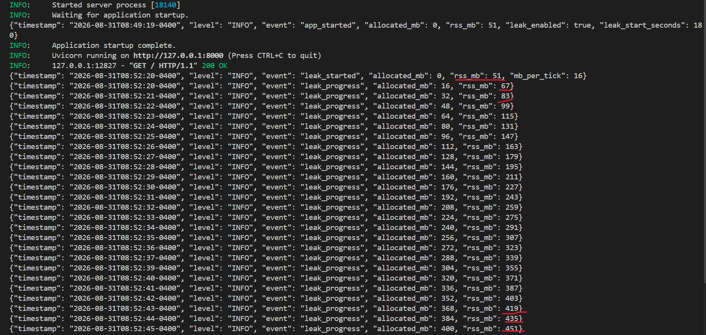

# AIOps-AgentCore: Demo workload

[Back](../README.md)

- [AIOps-AgentCore: Demo workload](#aiops-agentcore-demo-workload)
  - [FastAPI Application](#fastapi-application)
  - [Docker image](#docker-image)
  - [K8s - local](#k8s---local)
  - [K8s - EKS](#k8s---eks)

---

## FastAPI Application

```bash
# init
python -m venv .venv
pip install -r demo-workload/requirements-dev.txt

# run
cd demo-workload
python -m uvicorn src.main:app

# test
pytest demo-workload/
# 5 passed
```

- Test: rss accumulating



---

## Docker image

```sh
docker build -t aiops-agentcore-workload:local demo-workload/

# test: leak in 10s
docker run -d --name oomtest --memory=256m --memory-swap=256m -e LEAK_START_SECONDS=10 -e LEAK_MB_PER_TICK=16 aiops-agentcore-workload:local

# wait for stop and print exit code
docker wait oomtest
# 137

# inspect reason
docker inspect oomtest --format "{{.State.OOMKilled}} {{.State.ExitCode}}"
# true 137

# test:
docker run -d --name oomtest01 --memory=256m --memory-swap=256m -e LEAK_START_SECONDS=120 -e LEAK_MB_PER_TICK=4 -e LEAK_INTERVAL_SECONDS=1 aiops-agentcore-workload:local

# wait for stop and print exit code
docker wait oomtest01
# 137

docker inspect oomtest01 --format "{{.State.OOMKilled}} {{.State.ExitCode}}"
# true 137
```

- Push to ECR

```sh
# login
aws ecr get-login-password --region ca-central-1 | docker login --username AWS --password-stdin "099139718958.dkr.ecr.ca-central-1.amazonaws.com"

terraform -chdir=infra/project output -raw ecr_repo_workload_url
# 099139718958.dkr.ecr.ca-central-1.amazonaws.com/aiops-agentcore-workload

docker build -t "099139718958.dkr.ecr.ca-central-1.amazonaws.com/aiops-agentcore-workload:latest" demo-workload/

docker push "099139718958.dkr.ecr.ca-central-1.amazonaws.com/aiops-agentcore-workload:latest"
```

---

## K8s - local

```sh
# deploy
kubectl apply -f k8s/
# namespace/demo-workload created
# deployment.apps/aiops-agentcore-workload created
# service/aiops-agentcore-workload created

# confirm
kubectl get po -n demo-workload -w
# NAME                                        READY   STATUS    RESTARTS   AGE
# aiops-agentcore-workload-6ccbd8bd96-zmtjw   1/1     Running   0          49s
# aiops-agentcore-workload-6ccbd8bd96-zmtjw   1/1     Running   0          2m32s
# aiops-agentcore-workload-6ccbd8bd96-zmtjw   0/1     OOMKilled   0          2m59s
# aiops-agentcore-workload-6ccbd8bd96-zmtjw   0/1     Running     1 (1s ago)   2m59s
# aiops-agentcore-workload-6ccbd8bd96-zmtjw   1/1     Running     1 (12s ago)   3m10s
# aiops-agentcore-workload-6ccbd8bd96-zmtjw   1/1     Running     1 (12s ago)   3m10s

kubectl describe pod -n demo-workload -l app=aiops-agentcore-workload | grep -A4 Last
# Last State:     Terminated
#   Reason:       OOMKilled
#   Exit Code:    137
#   Started:      Mon, 31 Aug 2026 14:34:39 -0400
#   Finished:     Mon, 31 Aug 2026 14:37:37 -0400

# confirm last ram size
kubectl logs -n demo-workload aiops-agentcore-workload-6ccbd8bd96-zmtjw --previous | tail -1
# {"timestamp": "2026-08-31T18:43:41+0000", "level": "INFO", "event": "leak_progress", "allocated_mb": 220, "rss_mb": 271}
```

---

## K8s - EKS

```sh
# update config
aws eks update-kubeconfig --region ca-central-1 --name aiops-agentcore
# Added new context arn:aws:eks:ca-central-1:099139718958:cluster/aiops-agentcore to C:\Users\simon\.kube\config

# deploy app: test OOM
kubectl apply -f k8s/
# namespace/demo-workload created
# deployment.apps/aiops-agentcore-workload created
# service/aiops-agentcore-workload created

# confirm OOM
kubectl get po -n demo-workload -w
# NAME                              READY   STATUS    RESTARTS   AGE
# kube-agent-app-78c8d9b87f-2q8gx   1/1     Running   0          90s
# kube-agent-app-78c8d9b87f-2q8gx   0/1     OOMKilled   0          3m3s
# kube-agent-app-78c8d9b87f-2q8gx   0/1     Running     1 (2s ago)   3m4s

kubectl describe pod -n demo-workload -l app=aiops-agentcore-workload | grep -A4 Last
# Last State:     Terminated
#   Reason:       OOMKilled
#   Exit Code:    137
#   Started:      Mon, 31 Aug 2026 15:38:17 -0400
#   Finished:     Mon, 31 Aug 2026 15:41:14 -0400
```
