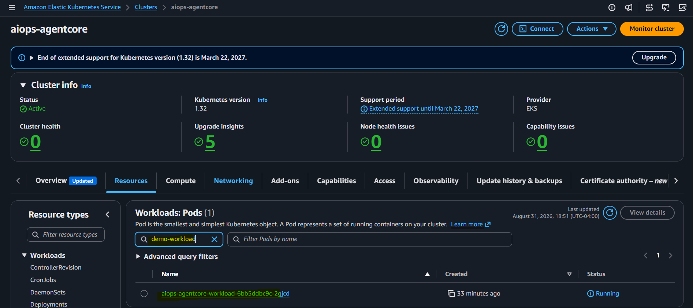

# AIOps-AgentCore: Infrastructure

[Back](../README.md)

- [AIOps-AgentCore: Infrastructure](#aiops-agentcore-infrastructure)
  - [Project Resources](#project-resources)
  - [Project level](#project-level)
  - [Cluster level](#cluster-level)

---

## Project Resources

| Resource            | Name                                                           |
| ------------------- | -------------------------------------------------------------- |
| ECR repository      | `kube-agent-workloa`, `kube-agent-trigger`, `kube-agent-agent` |
| S3 bucket           | `kube-agent-project`                                           |
| IAM role (ECR push) | `kube-agent-project-github-ecr-push`                           |

---

## Project level

```bash
# Initialise the remote backend and download providers.
terraform -chdir=infra/project init -backend-config=backend.tfvars

# Formatting and static validation, as run by CI.
terraform -chdir=infra/project fmt -check -recursive && terraform -chdir=infra/project validate

# Review, then apply.
terraform -chdir=infra/project plan
terraform -chdir=infra/project apply -auto-approve

# Read outputs
terraform -chdir=infra/project output
terraform -chdir=infra/project output -raw github_oidc_role_arn
terraform -chdir=infra/project output -raw github_terraform_role_arn
terraform -chdir=infra/project output -raw ecr_registry
```

Verify against AWS:

```bash
# ecr
aws ecr describe-repositories --region ca-central-1 --query 'repositories[].repositoryName' | grep aiops
# "aiops-agentcore-trigger",
# "aiops-agentcore-agent",
# "aiops-agentcore-workload"
```

---

## Cluster level

- `infra/cluster/`
  - VPC, EKS, node group, OIDC

```sh
terraform -chdir=infra/cluster init -backend-config=backend.tfvars
terraform -chdir=infra/cluster fmt && terraform -chdir=infra/cluster validate

terraform -chdir=infra/cluster plan
terraform -chdir=infra/cluster apply -auto-approve

terraform -chdir=infra/cluster output
terraform -chdir=infra/cluster destroy -auto-approve
```


