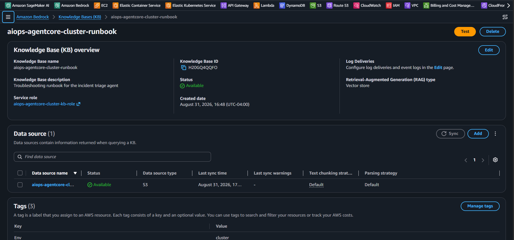

# AIOps-AgentCore: Bedrock knowledge base

[Back](../README.md)

- [AIOps-AgentCore: Bedrock knowledge base](#aiops-agentcore-bedrock-knowledge-base)
  - [Bedrock knowledge base](#bedrock-knowledge-base)

---

## Bedrock knowledge base

```sh
# get kb
terraform -chdir=infra/cluster output -raw bedrock_kb_id
# H20GQ4QQFO

# get kb source
terraform -chdir=infra/cluster output -raw  bedrock_kb_data_source_id
# B6VKIGO26Z

# ingest kb from data source
aws bedrock-agent start-ingestion-job --knowledge-base-id "H20GQ4QQFO" --data-source-id "B6VKIGO26Z" --region ca-central-1
# {
#     "ingestionJob": {
#         "knowledgeBaseId": "H20GQ4QQFO",
#         "dataSourceId": "B6VKIGO26Z",
#         "ingestionJobId": "ZAY0FKBGW6",
#         "status": "STARTING",
#         "statistics": {
#             "numberOfDocumentsScanned": 0,
#             "numberOfMetadataDocumentsScanned": 0,
#             "numberOfNewDocumentsIndexed": 0,
#             "numberOfModifiedDocumentsIndexed": 0,
#             "numberOfMetadataDocumentsModified": 0,
#             "numberOfDocumentsDeleted": 0,
#             "numberOfDocumentsFailed": 0,
#             "numberOfDocumentsSkipped": 0
#         },
#         "startedAt": "2026-08-31T21:08:46.990438+00:00",
#         "updatedAt": "2026-08-31T21:08:46.990438+00:00"
#     }
# }

# confirm injest job complete
aws bedrock-agent get-ingestion-job --knowledge-base-id "H20GQ4QQFO" --data-source-id "B6VKIGO26Z" --ingestion-job-id "ZAY0FKBGW6" --region ca-central-1 --query "ingestionJob.[status,statistics.numberOfNewDocumentsIndexed,statistics.numberOfDocumentsFailed]" --output text
# COMPLETE       1       0

# test retrieve
aws bedrock-agent-runtime retrieve --knowledge-base-id "H20GQ4QQFO" --region ca-central-1 --retrieval-query '{"text":"container exit code 137"}' --query 'retrievalResults[].[score]' --output text
# 0.8331561982631683
```


