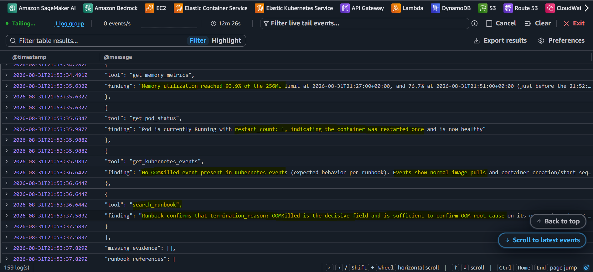
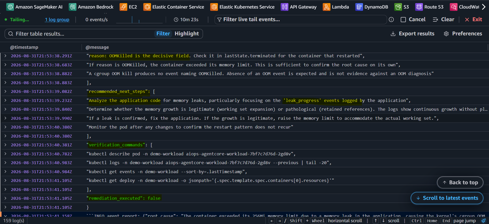
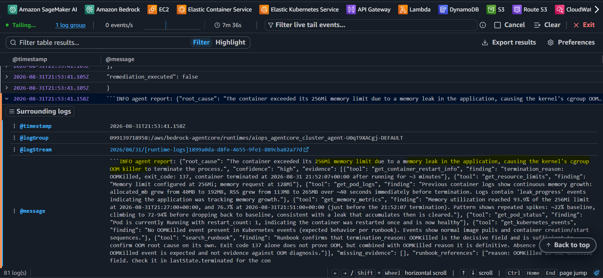
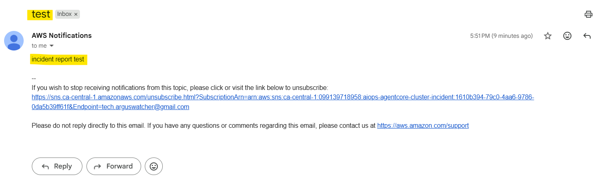

# AIOps-AgentCore: Agent with `Amazon AgentCore`

[Back](../README.md)

- [AIOps-AgentCore: Agent with `Amazon AgentCore`](#aiops-agentcore-agent-with-amazon-agentcore)
  - [Agent](#agent)
    - [Agent image](#agent-image)
    - [AgentCore deploy](#agentcore-deploy)
    - [Test runtime](#test-runtime)
  - [Confirm invocation](#confirm-invocation)
  - [Notification](#notification)
    - [Dev email](#dev-email)
    - [Slack](#slack)

---

## Agent

- paths

```
GET  /ping        -> 200 {"status": "Healthy"}
POST /invocations -> 200 status=success, root_cause=OOM killer, 6 evidence items
```

- Model
  - `global.anthropic.claude-haiku-4-5-20251001-v1:0`
  - Cost: **~$0.029 per report** (20.7k in / 1.6k out at Haiku 4.5 rates).

- Run locally

```sh
pip install -r agent/requirements.txt
pytest agent/
# 7 passed

cd agent/src
KNOWLEDGE_BASE_ID=DR2GI2F7DE AWS_REGION=ca-central-1 \
  ../../.venv/Scripts/python.exe agent.py incident-demo kube-agent-app
```

---

### Agent image

```sh
terraform -chdir=infra/project output -raw ecr_repo_agent_url
# 099139718958.dkr.ecr.ca-central-1.amazonaws.com/aiops-agentcore-agent

# run QEMU: agent build arm64; but windows in amd64
docker run --privileged --rm tonistiigi/binfmt --install arm64

# build and push
docker buildx build --platform linux/arm64 -t "099139718958.dkr.ecr.ca-central-1.amazonaws.com/aiops-agentcore-agent:latest" --push agent/
```

---

### AgentCore deploy

```sh
terraform -chdir=infra/cluster fmt && terraform -chdir=infra/cluster validate
terraform -chdir=infra/cluster apply -auto-approve
```

---

### Test runtime

```sh
terraform -chdir=infra/cluster output -raw agent_runtime_arn
# arn:aws:bedrock-agentcore:ca-central-1:099139718958:runtime/aiops_agentcore_cluster_agent-U0qT9XACgj

# test runtime
aws bedrock-agentcore invoke-agent-runtime --agent-runtime-arn "arn:aws:bedrock-agentcore:ca-central-1:099139718958:runtime/aiops_agentcore_cluster_agent-U0qT9XACgj" --region ca-central-1 --content-type application/json --payload fileb://agent/runtime_test/payload.json agent/runtime_test/out.json
# {
#     "runtimeSessionId": "8cb3dbf6-69ac-4e34-9b97-7a0eedcdd751",
#     "contentType": "application/json",
#     "statusCode": 200
# }
```

---

## Confirm invocation

- check log

```sh
aws logs tail "/aws/bedrock-agentcore/runtimes/aiops_agentcore_cluster_agent-U0qT9XACgj-DEFAULT" --region ca-central-1 --follow

```

- Confirm in cloudwatch log group








---

## Notification

### Dev email

```sh
# test publish
aws sns publish --topic-arn "arn:aws:sns:ca-central-1:099139718958:aiops-agentcore-cluster-incident" --subject "test" --message "incident report test" --region ca-central-1
# {
#     "MessageId": "050c38a4-7319-585f-8e48-5bab8a979387"
# }

```



---

### Slack


