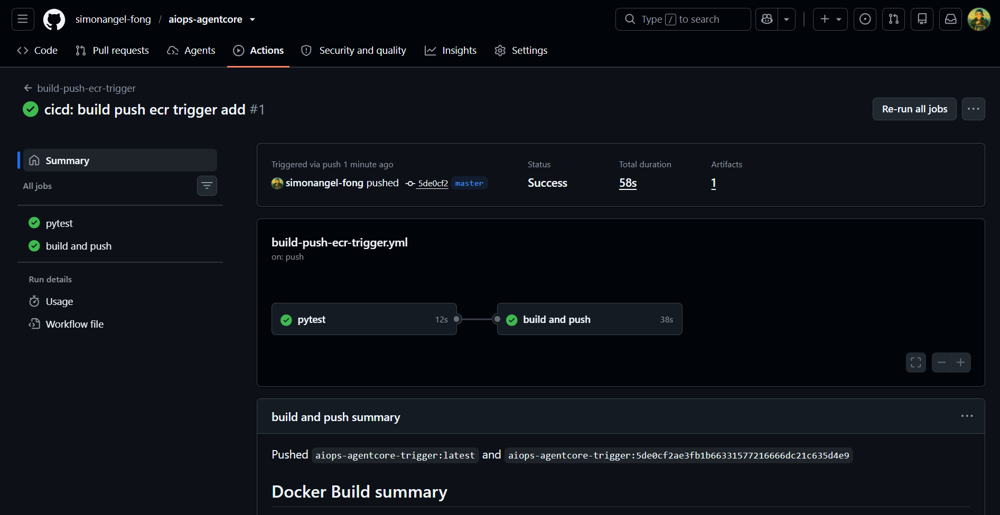
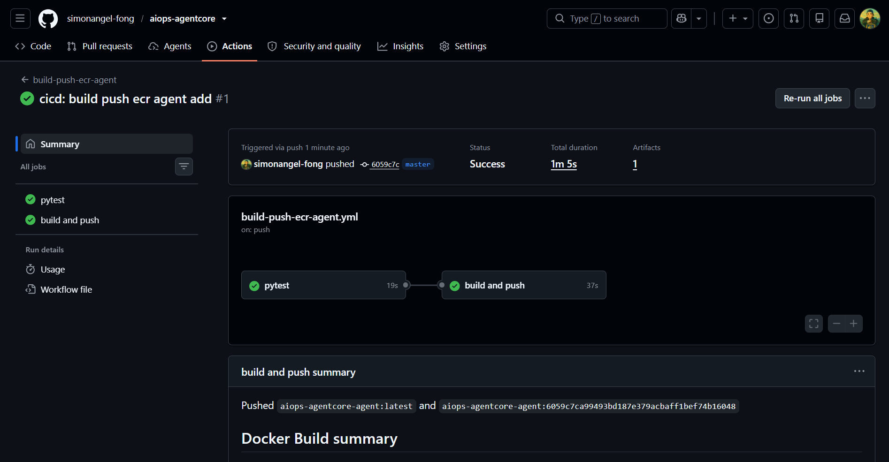

# AIOps-AgentCore: CD/CD

[Back](../README.md)

- [AIOps-AgentCore: CD/CD](#aiops-agentcore-cdcd)
  - [GitHub config](#github-config)
  - [Pipeline](#pipeline)

---

## GitHub config

- Variables

| Variable              | descripion                   |
| --------------------- | ---------------------------- |
| AWS_ROLE_ARN_ECR_OIDC | OIDC role for GitHub Actions |

```sh
terraform -chdir=infra/project output -raw github_oidc_role_arn
gh variable set AWS_ROLE_ARN_ECR_OIDC -b "ecr_push_role"
# ✓ Created variable AWS_ROLE_ARN_ECR_OIDC for simonangel-fong/aiops-agentcore


```

---

## Pipeline

| Pipeline                | Description                              |
| ----------------------- | ---------------------------------------- |
| build-push-ecr-workload | build and push demo workload image       |
| build-push-ecr-trigger  | build and push demo lambda trigger image |

```sh
gh workflow run build-push-ecr-workload

gh workflow run build-push-ecr-trigger

gh workflow run build-push-ecr-agent
```





