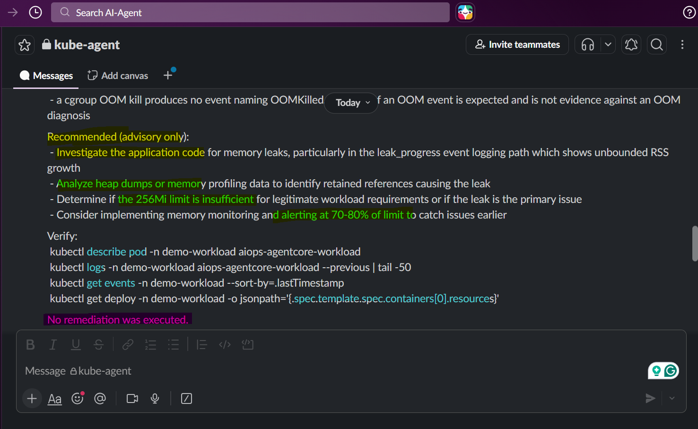

# AIOps-AgentCore: Demo

[Back](../README.md)

- [AIOps-AgentCore: Demo](#aiops-agentcore-demo)
  - [Deploy](#deploy)
  - [Alarm with Slack](#alarm-with-slack)
  - [Confirm and debug](#confirm-and-debug)

---

## Deploy

```sh
# deploy eks

# deploy workload
```

---

## Alarm with Slack




---

## Confirm and debug

```sh
# check log
kubectl logs -n demo-workload deploy/aiops-agentcore-workload --previous | tail -20
# Defaulted container "app" out of: app, opentelemetry-auto-instrumentation-java (init), opentelemetry-auto-instrumentation-nodejs (init), opentelemetry-auto-instrumentation-python (init), opentelemetry-auto-instrumentation-dotnet (init)
# {"timestamp": "2026-08-31T22:14:54+0000", "level": "INFO", "event": "leak_progress", "allocated_mb": 120, "rss_mb": 194}
# {"timestamp": "2026-08-31T22:14:55+0000", "level": "INFO", "event": "leak_progress", "allocated_mb": 124, "rss_mb": 197}
# {"timestamp": "2026-08-31T22:14:56+0000", "level": "INFO", "event": "leak_progress", "allocated_mb": 128, "rss_mb": 202}
# {"timestamp": "2026-08-31T22:14:57+0000", "level": "INFO", "event": "leak_progress", "allocated_mb": 132, "rss_mb": 205}
# {"timestamp": "2026-08-31T22:14:58+0000", "level": "INFO", "event": "leak_progress", "allocated_mb": 136, "rss_mb": 210}
# {"timestamp": "2026-08-31T22:14:59+0000", "level": "INFO", "event": "leak_progress", "allocated_mb": 140, "rss_mb": 213}
# {"timestamp": "2026-08-31T22:15:00+0000", "level": "INFO", "event": "leak_progress", "allocated_mb": 144, "rss_mb": 218}
# {"timestamp": "2026-08-31T22:15:01+0000", "level": "INFO", "event": "leak_progress", "allocated_mb": 148, "rss_mb": 222}
# {"timestamp": "2026-08-31T22:15:02+0000", "level": "INFO", "event": "leak_progress", "allocated_mb": 152, "rss_mb": 226}
# {"timestamp": "2026-08-31T22:15:03+0000", "level": "INFO", "event": "leak_progress", "allocated_mb": 156, "rss_mb": 230}
# {"timestamp": "2026-08-31T22:15:04+0000", "level": "INFO", "event": "leak_progress", "allocated_mb": 160, "rss_mb": 234}
# {"timestamp": "2026-08-31T22:15:05+0000", "level": "INFO", "event": "leak_progress", "allocated_mb": 164, "rss_mb": 238}
# {"timestamp": "2026-08-31T22:15:06+0000", "level": "INFO", "event": "leak_progress", "allocated_mb": 168, "rss_mb": 242}
# {"timestamp": "2026-08-31T22:15:07+0000", "level": "INFO", "event": "leak_progress", "allocated_mb": 172, "rss_mb": 246}
# {"timestamp": "2026-08-31T22:15:08+0000", "level": "INFO", "event": "leak_progress", "allocated_mb": 176, "rss_mb": 250}
# {"timestamp": "2026-08-31T22:15:09+0000", "level": "INFO", "event": "leak_progress", "allocated_mb": 180, "rss_mb": 254}
# {"timestamp": "2026-08-31T22:15:10+0000", "level": "INFO", "event": "leak_progress", "allocated_mb": 184, "rss_mb": 258}
# {"timestamp": "2026-08-31T22:15:11+0000", "level": "INFO", "event": "leak_progress", "allocated_mb": 188, "rss_mb": 262}
# {"timestamp": "2026-08-31T22:15:12+0000", "level": "INFO", "event": "leak_progress", "allocated_mb": 192, "rss_mb": 266}
# {"timestamp": "2026-08-31T22:15:13+0000", "level": "INFO", "event": "leak_progress", "allocated_mb": 196, "rss_mb": 270}

# check event
kubectl get events -n demo-workload --sort-by=.lastTimestamp
# LAST SEEN   TYPE      REASON              OBJECT                                           MESSAGE
# 44m         Normal    Pulled              pod/aiops-agentcore-workload-676cd8558d-qg8bl    (combined from similar events): Successfully pulled image "099139718958.dkr.ecr.ca-central-1.amazonaws.com/aiops-agentcore-workload" in 111ms (111ms including waiting). Image size: 55991820 bytes.
# 29m         Warning   BackOff             pod/aiops-agentcore-workload-676cd8558d-qg8bl    Back-off restarting failed container app in pod aiops-agentcore-workload-676cd8558d-qg8bl_demo-workload(e3b5d96f-859a-48fa-bff2-e2841298de85)
# 28m         Normal    SuccessfulCreate    replicaset/aiops-agentcore-workload-7bf7c7d76d   Created pod: aiops-agentcore-workload-7bf7c7d76d-2gd8v
# 28m         Normal    ScalingReplicaSet   deployment/aiops-agentcore-workload              Scaled up replica set aiops-agentcore-workload-7bf7c7d76d from 0 to 1
# 28m         Normal    Scheduled           pod/aiops-agentcore-workload-7bf7c7d76d-2gd8v    Successfully assigned demo-workload/aiops-agentcore-workload-7bf7c7d76d-2gd8v to ip-10-0-1-34.ca-central-1.compute.internal
# 28m         Normal    Pulling             pod/aiops-agentcore-workload-7bf7c7d76d-2gd8v    Pulling image "602401143452.dkr.ecr.ca-central-1.amazonaws.com/eks/observability/adot-autoinstrumentation-java:v2.29.0"
# 28m         Normal    Created             pod/aiops-agentcore-workload-7bf7c7d76d-2gd8v    Created container: opentelemetry-auto-instrumentation-java
# 28m         Normal    Pulled              pod/aiops-agentcore-workload-7bf7c7d76d-2gd8v    Successfully pulled image "602401143452.dkr.ecr.ca-central-1.amazonaws.com/eks/observability/adot-autoinstrumentation-java:v2.29.0" in 1.181s (1.181s including waiting). Image size: 39580214 bytes.
# 28m         Normal    Started             pod/aiops-agentcore-workload-7bf7c7d76d-2gd8v    Started container opentelemetry-auto-instrumentation-java
# 28m         Normal    Pulling             pod/aiops-agentcore-workload-7bf7c7d76d-2gd8v    Pulling image "602401143452.dkr.ecr.ca-central-1.amazonaws.com/eks/observability/adot-autoinstrumentation-node:v0.12.0"
# 28m         Normal    Pulled              pod/aiops-agentcore-workload-7bf7c7d76d-2gd8v    Successfully pulled image "602401143452.dkr.ecr.ca-central-1.amazonaws.com/eks/observability/adot-autoinstrumentation-node:v0.12.0" in 2.745s (2.745s including waiting). Image size: 12898233 bytes.
# 28m         Normal    Created             pod/aiops-agentcore-workload-7bf7c7d76d-2gd8v    Created container: opentelemetry-auto-instrumentation-nodejs
# 28m         Normal    Started             pod/aiops-agentcore-workload-7bf7c7d76d-2gd8v    Started container opentelemetry-auto-instrumentation-nodejs
# 28m         Normal    Pulling             pod/aiops-agentcore-workload-676cd8558d-qg8bl    Pulling image "099139718958.dkr.ecr.ca-central-1.amazonaws.com/aiops-agentcore-workload"
# 28m         Normal    Pulled              pod/aiops-agentcore-workload-676cd8558d-qg8bl    Successfully pulled image "099139718958.dkr.ecr.ca-central-1.amazonaws.com/aiops-agentcore-workload" in 103ms (103ms including waiting). Image size: 55991820 bytes.
# 28m         Normal    Pulling             pod/aiops-agentcore-workload-7bf7c7d76d-2gd8v    Pulling image "602401143452.dkr.ecr.ca-central-1.amazonaws.com/eks/observability/adot-autoinstrumentation-python:v0.19.0"
# 28m         Normal    Created             pod/aiops-agentcore-workload-7bf7c7d76d-2gd8v    Created container: opentelemetry-auto-instrumentation-python
# 28m         Normal    Pulled              pod/aiops-agentcore-workload-7bf7c7d76d-2gd8v    Successfully pulled image "602401143452.dkr.ecr.ca-central-1.amazonaws.com/eks/observability/adot-autoinstrumentation-python:v0.19.0" in 1.047s (1.047s including waiting). Image size: 7091882 bytes.
# 28m         Normal    Started             pod/aiops-agentcore-workload-7bf7c7d76d-2gd8v    Started container opentelemetry-auto-instrumentation-python
# 28m         Normal    Pulling             pod/aiops-agentcore-workload-7bf7c7d76d-2gd8v    Pulling image "602401143452.dkr.ecr.ca-central-1.amazonaws.com/eks/observability/adot-autoinstrumentation-dotnet:v1.14.0"
# 28m         Normal    Pulled              pod/aiops-agentcore-workload-7bf7c7d76d-2gd8v    Successfully pulled image "602401143452.dkr.ecr.ca-central-1.amazonaws.com/eks/observability/adot-autoinstrumentation-dotnet:v1.14.0" in 1.672s (1.672s including waiting). Image size: 36241625 bytes.
# 28m         Normal    Created             pod/aiops-agentcore-workload-7bf7c7d76d-2gd8v    Created container: opentelemetry-auto-instrumentation-dotnet
# 28m         Normal    Started             pod/aiops-agentcore-workload-7bf7c7d76d-2gd8v    Started container opentelemetry-auto-instrumentation-dotnet
# 28m         Normal    Pulled              pod/aiops-agentcore-workload-7bf7c7d76d-2gd8v    Successfully pulled image "099139718958.dkr.ecr.ca-central-1.amazonaws.com/aiops-agentcore-workload" in 85ms (85ms including waiting). Image size: 55991820 bytes.
# 28m         Normal    ScalingReplicaSet   deployment/aiops-agentcore-workload              Scaled down replica set aiops-agentcore-workload-676cd8558d from 1 to 0
# 28m         Normal    SuccessfulDelete    replicaset/aiops-agentcore-workload-676cd8558d   Deleted pod: aiops-agentcore-workload-676cd8558d-qg8bl
# 25m         Normal    Created             pod/aiops-agentcore-workload-7bf7c7d76d-2gd8v    Created container: app
# 25m         Normal    Started             pod/aiops-agentcore-workload-7bf7c7d76d-2gd8v    Started container app
# 25m         Normal    Pulled              pod/aiops-agentcore-workload-7bf7c7d76d-2gd8v    Successfully pulled image "099139718958.dkr.ecr.ca-central-1.amazonaws.com/aiops-agentcore-workload" in 97ms (98ms including waiting). Image size: 55991820 bytes.
# 22m         Normal    Pulled              pod/aiops-agentcore-workload-7bf7c7d76d-2gd8v    Successfully pulled image "099139718958.dkr.ecr.ca-central-1.amazonaws.com/aiops-agentcore-workload" in 105ms (105ms including waiting). Image size: 55991820 bytes.
# 5m6s        Normal    Pulling             pod/aiops-agentcore-workload-7bf7c7d76d-2gd8v    Pulling image "099139718958.dkr.ecr.ca-central-1.amazonaws.com/aiops-agentcore-workload"
# 2m10s       Warning   BackOff             pod/aiops-agentcore-workload-7bf7c7d76d-2gd8v    Back-off restarting failed container app in pod aiops-agentcore-workload-7bf7c7d76d-2gd8v_demo-workload(2ffcde3f-88ad-4040-823c-e4876b652821)
# ubuntuadmin@wsl-ubuntu:~$
```

- debug by swith `LEAK_ENABLED=false`

```yaml
env:
  - name: LEAK_ENABLED # enable leak
    value: "false" # debug by "false"
```

```sh
# fix
kubectl apply -f k8s/demo-workload.yaml
# namespace/demo-workload unchanged
# deployment.apps/aiops-agentcore-workload configured
# service/aiops-agentcore-workload unchanged

# confirm
kubectl get po -n demo-workload -w
# NAME                                        READY   STATUS    RESTARTS   AGE
# aiops-agentcore-workload-6bb5ddbc9c-2gjcd   1/1     Running   0          3m7s
```

- Alarm get resolved


